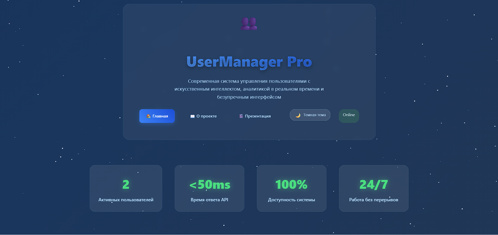
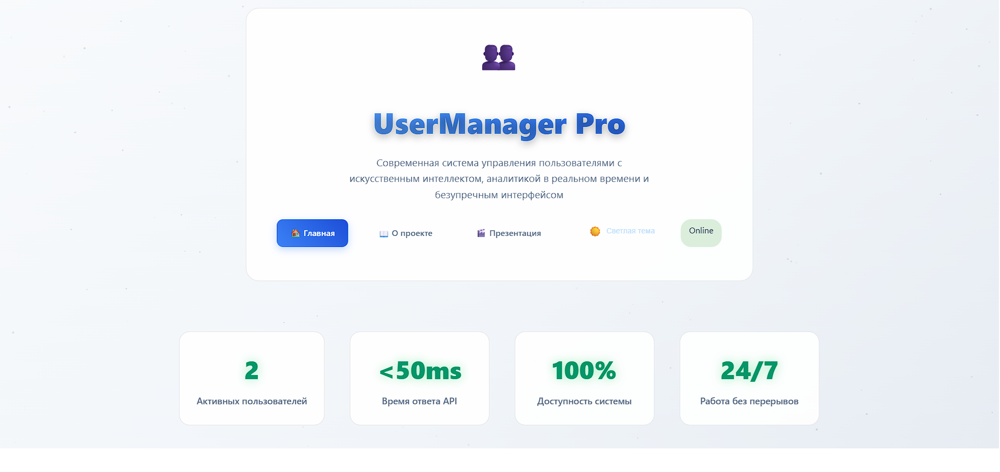
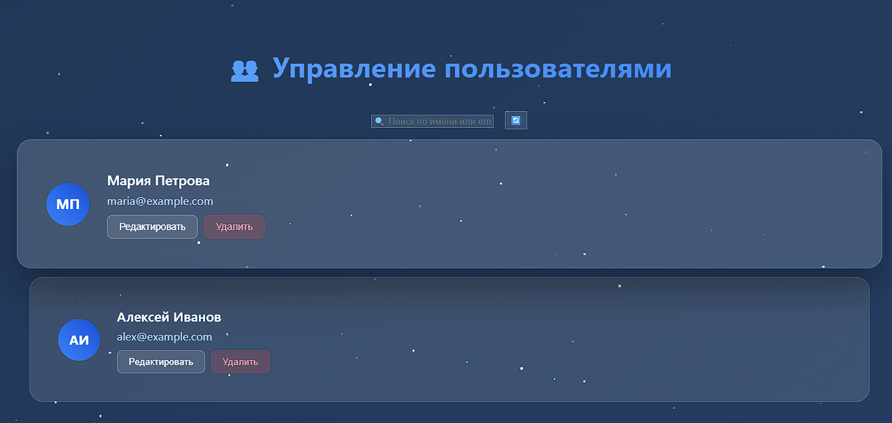
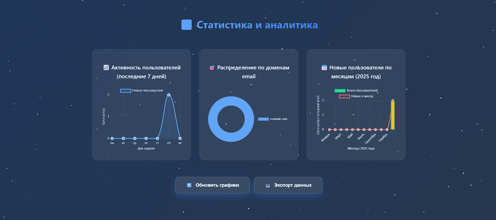

# 🚀 UserManager Pro - Modern CRM System


**UserManager Pro** — современная CRM система для управления пользователями с поддержкой двух режимов работы: серверного и локального. Разработана на стеке Go + HTML5 + CSS3 + JavaScript.

## 🌐 Демо

- 🖥️ **Основное приложение:** [https://dmitriy43229.github.io/Go-Project777_GoStory/](https://dmitriy43229.github.io/Go-Project777_GoStory/)
- 📋 **О проекте:** [https://dmitriy43229.github.io/Go-Project777_GoStory/about.html]
(https://dmitriy43229.github.io/Go-Project777_GoStory/about.html)
- 🎯 **Презентация:** [https://dmitriy43229.github.io/Go-Project777_GoStory/presentation.html](https://dmitriy43229.github.io/Go-Project777_GoStory/presentation.html)

## ✨ Особенности

- 🌐 **Два режима работы:** серверный (общие данные) и локальный (приватный)
- 🔐 **Административная панель:** защищенный доступ по паролю
- ⚡ **Высокая производительность:** оптимизированный Go бэкенд
- 📱 **Адаптивный дизайн:** работает на всех устройствах
- 🎨 **Темная/светлая тема:** переключение между темами
- 🔄 **Service Worker:** поддержка офлайн-режима (PWA)
- 📊 **Статистика в реальном времени:** мониторинг активности

## 🏗️ Архитектура

### 🖥️ Бэкенд
- **Go (Golang)** - высокопроизводительный сервер
- **REST API** - стандартизированные endpoints
- **In-memory база данных** - быстрый доступ к данным
- **CORS поддержка** - кросс-доменные запросы

### 📱 Фронтенд
- **HTML5 & CSS3** - современная верстка
- **JavaScript (ES6+)** - интерактивность
- **LocalStorage** - локальное хранение данных
- **Service Worker** - PWA возможности

## 📁 Структура проекта
GOSTORY/
├── .github/
│   └── workflows/
│       └── clear-cache.yml
├── .vscode/
│   └── settings.json
├── screenshots/
│   ├── main-dark.png
│   ├── light.png
│   ├── stats.png
│   └── main-users.png
├── .gitignore
├── .htaccess
├── .nojekyll
├── about.html
├── go.mod
├── go.sum
├── index.html
├── LICENSE
├── README.md
├── script.js
├── server.go
├── service-worker.js
├── style.css
├── update-checker.js
├── version.json
└── version.php

**📊 Статистика:**
- 📁 **Папок:** 4
- 🖼️ **Скриншотов** 4
- 📄 **Файлов:** 19
- 🏗️ **Всего элементов:** 27

## 🚀 Быстрый старт

### Использование онлайн-версии

Просто перейдите по ссылке: 
[https://dmitriy43229.github.io/Go-Project777_GoStory/]
(https://dmitriy43229.github.io/Go-Project777_GoStory/)

### Локальная разработка (опционально)

1. **Клонирование репозитория:**
   ```bash
   git clone https://github.com/Dmitriy43229/Go-Project777_GoStory.git
   cd Go-Project777/GoStory
2. Запуск локально: Откройте index.html в браузере

🔐 Административный доступ
Для доступа к административным функциям:

Нажмите кнопку "Вход администратора"

Введите пароль: admin123

Получите доступ к:

Переключению режимов (серверный/локальный)

Управлению пользователями

Системным настройкам

🌐 Режимы работы
Серверный режим 🌐
Все пользователи видят одинаковые данные

Данные хранятся на сервере

Режим по умолчанию для обычных пользователей

Локальный режим 🔒
Только администратор имеет доступ к данным

Данные хранятся в браузере (LocalStorage)

Полная конфиденциальность

📸 Скриншоты
<div align="center">   <br>   </div>
📈 Технологический стек
Фронтенд:

https://img.shields.io/badge/HTML5-E34F26?style=flat&logo=html5&logoColor=white

https://img.shields.io/badge/CSS3-1572B6?style=flat&logo=css3&logoColor=white

https://img.shields.io/badge/JavaScript-F7DF1E?style=flat&logo=javascript&logoColor=black

https://img.shields.io/badge/LocalStorage-FF6B6B?style=flat

Бэкенд:

https://img.shields.io/badge/Go-00ADD8?style=flat&logo=go&logoColor=white

https://img.shields.io/badge/REST_API-FF6B6B?style=flat

https://img.shields.io/badge/JSON-000000?style=flat&logo=json&logoColor=white

Инструменты:

https://img.shields.io/badge/Git-F05032?style=flat&logo=git&logoColor=white

https://img.shields.io/badge/VS_Code-007ACC?style=flat&logo=visual-studio-code&logoColor=white

https://img.shields.io/badge/GitHub_Pages-222222?style=flat&logo=github&logoColor=white

🤝 Вклад в проект
Форкните репозиторий

Создайте ветку для фичи (git checkout -b feature/AmazingFeature)

Закоммитьте изменения (git commit -m 'Add some AmazingFeature')

Запушьте в ветку (git push origin feature/AmazingFeature)

Откройте Pull Request

📄 Лицензия
Этот проект распространяется под лицензией MIT. Подробнее см. в файле LICENSE.

👨‍💻 Автор
Дмитрий Кобелев

GitHub: @Dmitriy43229

Проект: Go-Project777GoStory

🙏 Благодарности
Иконки от Font Awesome

Шрифты от Google Fonts

Badges от Shields.io

⭐ Если вам понравился проект, поставьте звезду на GitHub! ⭐

https://api.star-history.com/svg?repos=Dmitriy43229/Go-Project777_GoStory&type=Date